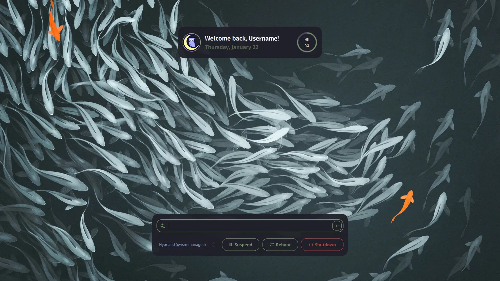

# Noctalia SDDM Theme (unofficial)

This repo represents my current attempts to mimic the Noctalia lock screen as a
theme for SDDM with the kanagawa color sheme as default

Inspiration: [Noctalia SDDM Theme](https://github.com/mahaveergurjar/sddm/tree/noctalia)
and [Noctalia Dev](https://noctalia.dev/)


## Features

- Multiple user support (clicking top card allows you to switch between users)
- Color sync with Noctalia-Shell via user-templates (optional)
- Script for installation / removal `./installer/install.sh`
  - theme directory: `/usr/share/sddm/themes/noctalia`
  - SDDM configuration : `/etc/sddm.conf` if default is not found you will be prompted
    to select a .conf file from within `/etc/sddm.conf.d/` directory
  - shell integration: `~/.config/noctalia/user-templates.toml` (optional)
- Wallpaper sync with Noctalia-Shell via script `sync-shell-wallpaper.sh` (optional) (Tested Noctalia Shell <= v4.7.5 )
- Various customizable settings via `theme.config` or
  `theme.template.config` see [Configuration](#configuration) section

> [!NOTE]
> Theme Dependencies
> `qt5-graphicaleffects` and `qt5-quickcontrols2`
> Misc Dependencies (installer)
> `jq` - used for handling .json mutations (wallpaper-sync)
> `awk` - use for handling .conf mutations (installer)

> [!NOTE]
> If you are using Wayland you might need
> to also install `qt5-wayland`

### Current W.I.P

- Migrate from qt5 to qt6

## Installation

Clone repo with `git clone https://github.com/mda-dev/noctalia-sddm-theme.git noctalia`

For quick information about what the installer will do,
you can run it with `--dry-run` argument and no changes will be made.

<details>
  <summary> Automatic (with scripts) </summary>
  Run the installer script from within the installer directory.

```sh
sudo bash ./installer/install.sh
```

You will be prompted during the installation for the following optional features:

- Noctalia-Shell color sync.
- Noctalia-Shell wallpaper sync. (Tested Noctalia-Shell <= v4.7.5)

If you install / configure the sync "features" you will need to change
the color scheme and wallpaper once for changes to take effect.

After installation you can use the [Test command](#test-theme-installation)
to view results

</details>

<details>
  <summary>
    Manual (scriptless)
  </summary>

### Theme

Copy directory to sddm themes with `sudo cp -r noctalia /usr/share/sddm/themes`

Activate theme by opening either default `/etc/sddm.conf` or `/etc/sddm.conf.d/CUSTOM.conf`
and changing the `Current` key to the following:

```ini
[Theme]
Current=noctalia
```

### Noctalia-Shell (optional)

Set file permissions for theme.conf (needed for Noctalia-Shell)

```sh
sudo chmod 666 "/usr/share/sddm/themes/noctalia/theme.conf"
```

### Color-Sync

Enable User Templates in Noctalia-Shell `Settings > Color Schemes > Templates`

Edit `~/.config/noctalia/user-templates.toml` Add the following lines to the bottom:

```ini
# SDDM GREETER
[templates.sddm]
input_path = "/usr/share/sddm/themes/noctalia/theme.template.conf"
output_path = "/usr/share/sddm/themes/noctalia/theme.conf"
```

### Wallpaper-sync

Open Noctalia-Shell `Settings > Hooks` and add the following inside
"Wallpaper changed" then press the Test button

```sh
/usr/share/sddm/themes/noctalia/sync-shell-wallpaper.sh
```

Set file permissions for background.png (gets overwritten by the script)

```sh
sudo chmod 666 "/usr/share/sddm/themes/noctalia/Assets/background.png"
```

</details>

## Test theme installation

```sh
sddm-greeter --test-mode --theme /usr/share/sddm/themes/noctalia
```

## Configuration

#### Avatar

The theme searches for the following files in the exact order they are listed below.
Once a file has been found the search stops.

```
$HOME/.face.icon
$HOME/.face
/usr/share/sddm/faces/$USER.face.icon
/var/lib/AccountsService/icons/$USER
/usr/share/sddm/themes/noctalia/Assets/logo.svg
```

#### General UI

The place where you can configure some settings changes
depending if you enable Color-Sync

<details>
<summary>With Color-Sync</summary>

Open `theme.template.conf` with your favorite editor and change any of the values
you see fit and then refresh your theme within Noctalia settings

> [!WARNING]
> Do not change values start with the letter `m` ex `mPrimary`, those are set by Noctalia-Shell
> whenever you change your theme.
> The Color-Sync won't work anymore

</details>

<details>
<summary>Without Color-Sync (standalone)</summary>

Open `theme.conf` file with your favorite editor and  
 change any of the values you see fit.

```sh
sudo nano /etc/share/sddm/themes/noctalia/theme.conf
```

</details>
